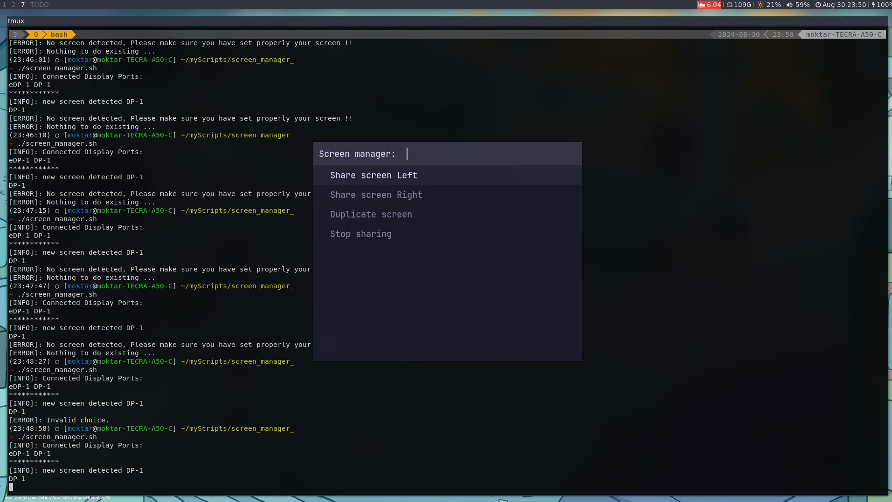

# screen-manager 
This is a CLI Tool that let's you manager multiple screen:
- Shares screen right to main screen 
- Shares screen left to main screen 
- Duplicates screen 
- Disable screen
It automatically detects which screen is connected and on which port (`HDMI` OR `VGA`)<br>
This command depends on `xrandr` to get the connected screens <br>
It also uses `notify-send` to send a notification error if no screens are detected <br>
It depends on `rofi`

## Installation 
- you need to be using `X11` as  display manager <br>
- `rofi` Installation
```bash 
sudo apt install -y rofi
```
- just copy the bash script to your favourite destination where you want to run it 
```bash 
sudo cp screen_manager.sh /usr/bin
```
## usage 
just run: 
```bash
screen_manager
```

## TODO: 

1- supports other platforms such as wayland (this script depends on `xrandr`, `X11` utility)<br>
2- manage multiple screens by enabling more user interaction (make the usr selects which screen )
